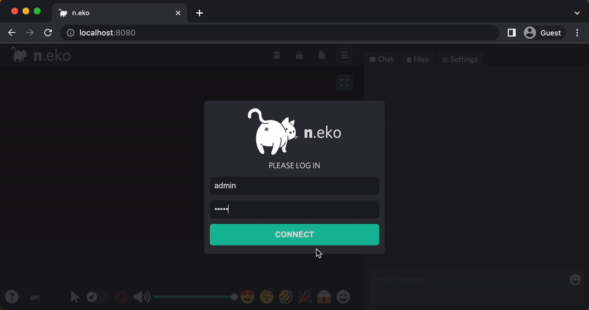
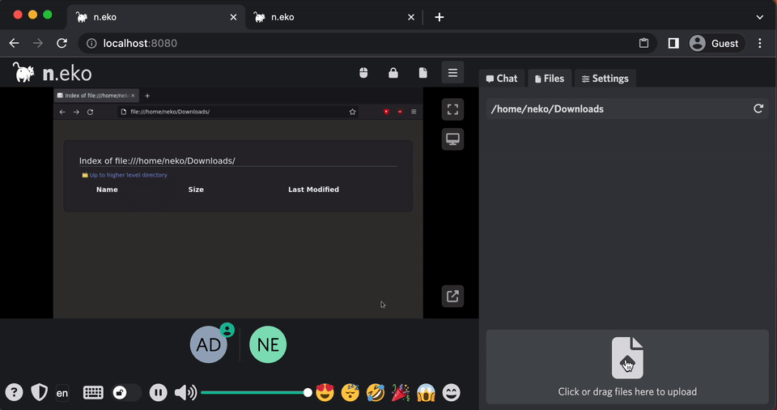

 
 

With `NEKO_FILE_TRANSFER_ENABLED=true`:

 
 

# n.eko

Welcome to Neko, a self-hosted virtual browser that runs in Docker and uses WebRTC technology. Neko is a powerful tool that allows you to **run a fully-functional browser in a virtual environment**, giving you the ability to **access the internet securely and privately from anywhere**. With Neko, you can browse the web, **run applications**, and perform other tasks just as you would on a regular browser, all within a **secure and isolated environment**. Whether you are a developer looking to test web applications, a **privacy-conscious user seeking a secure browsing experience**, or simply someone who wants to take advantage of the **convenience and flexibility of a virtual browser**, Neko is the perfect solution.

In addition to its security and privacy features, Neko offers the **ability for multiple users to access it simultaneously**. This makes it an ideal solution for teams or organizations that need to share access to a browser, as well as for individuals who want to use **multiple devices to access the same virtual environment**. With Neko, you can **easily and securely share access to a browser with others**, without having to worry about maintaining separate configurations or settings. Whether you need to **collaborate on a project**, access shared resources, or simply want to **share access to a browser with friends or family**, Neko makes it easy to do so.

Neko is also a great tool for **hosting watch parties** and interactive presentations. With its virtual browser capabilities, Neko allows you to host watch parties and presentations that are **accessible from anywhere**, without the need for in-person gatherings. This makes it easy to **stay connected with friends and colleagues**, even when you are unable to meet in person. With Neko, you can easily host a watch party or give an **interactive presentation**, whether it's for leisure or work. Simply invite your guests to join the virtual environment, and you can share the screen and **interact with them in real-time**.

## About

This app uses WebRTC to stream a desktop inside a docker container, original author made this because [rabb.it](https://en.wikipedia.org/wiki/Rabb.it) went under, and his internet could not handle streaming and discord kept crashing when his friend attempted to. He just wanted to watch anime with his friends ლ(ಠ益ಠლ) so he started digging throughout the internet and found a few *kinda* clones, but none of them had the virtual browser, then he found [Turtus](https://github.com/Khauri/Turtus), and he was able to figure out the rest.

Then I found [this](https://github.com/nurdism/neko) project and started to dig into it. I really liked the idea of having collaborative browser browsing together with multiple people, so I created a fork. Initially, I wanted to merge my changes to the upstream repository, but the original author did not have time for this project anymore, and it got eventually archived.

### Features

  * Text Chat (With basic markdown support, discord flavor)
  * Admin users (Kick, Ban & Force Give/Release Controls, Lock room)
  * Clipboard synchronization (on [supported browsers](https://developer.mozilla.org/en-US/docs/Web/API/Clipboard/readText))
  * Emote overlay
  * Ignore user (chat and emotes)
  * Persistent settings
  * Automatic Login with custom url args. (add `?usr=<your-user-name>&pwd=<room-pass>` to the url.)
  * Broadcasting room content using RTMP (to e.g. twitch or youtube...)
  * Bidirectional file transfer (if enabled)

### Why n.eko?

I like cats 🐱 (`Neko` is the Japanese word for cat), I'm a weeb/nerd.

***But why the cat butt?*** Because cats are *assholes*, but you love them anyway.
