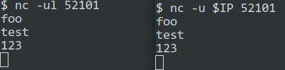

# Troubleshooting

Neko UI loads, but you don't see the screen, and it gives you `connection timeout` or `disconnected` error?

## Test your client

Some browser may block WebRTC access by default. You can check if it is enabled by going to `about:webrtc` or `chrome://webrtc-internals` in your browser.

Check if your extensions are not blocking WebRTC access. For example, Privacy Badger or Private Internet Access blocks WebRTC by default.

Test whether your client [supports](https://www.webrtc-experiment.com/DetectRTC/) and can [connect to WebRTC](https://www.webcasts.com/webrtc/).

## Networking

Most problems are networking related.

### Check if your ports are correctly exposed using docker

Check that your ephemeral port range `NEKO_EPR` is correctly exposed as `/udp` port range.

In following example, specified range `52000-52100` must be also exposed using docker.

```diff
version: "3.4"
services:
  neko:
    image: "m1k1o/neko:firefox"
    restart: "unless-stopped"
    shm_size: "2gb"
    ports:
      - "8080:8080"
+      - "52000-52100:52000-52100/udp"
    environment:
     NEKO_SCREEN: 1920x1080@30
     NEKO_PASSWORD: neko
     NEKO_PASSWORD_ADMIN: admin
+     NEKO_EPR: 52000-52100
     NEKO_ICELITE: 1
```

### Validate UDP ports reachability

Ensure, that your ports are reachable through your external IP.

To validate UDP connection the simplest way, run this on your server:

```shell
nc -ul 52101
```

And this on your local client:

```shell
nc -u [server ip] 52101
```
Then try to type on one end, you should see characters on the other side.



If it does not work for you, then most likely your port forwarding is not working correctly. Or your ISP is blocking traffic.

### Check if your external IP was determined correctly

One of the first logs, when the server starts, writes down your external IP that will be sent to your clients to connect to.

```shell
docker-compose logs neko | grep nat_ips
```

You should see this:

```
11:11AM INF webrtc starting ephemeral_port_range=52000-52100 ice_lite=true ice_servers="[{URLs:[stun:stun.l.google.com:19302] Username: Credential:<nil> CredentialType:password}]" module=webrtc nat_ips=<your-IP>
```

If your IP is not correct, you can specify own IP resolver using `NEKO_IPFETCH`. It needs to return IP address that will be used.

```diff
version: "3.4"
services:
  neko:
    image: "m1k1o/neko:firefox"
    restart: "unless-stopped"
    shm_size: "2gb"
    ports:
      - "8080:8080"
      - "52000-52100:52000-52100/udp"
    environment:
     NEKO_SCREEN: 1920x1080@30
     NEKO_PASSWORD: neko
     NEKO_PASSWORD_ADMIN: admin
     NEKO_EPR: 52000-52100
     NEKO_ICELITE: 1
+     NEKO_IPFETCH: https://ifconfig.co/ip
```

Or you can specify your IP address manually using `NEKO_NAT1TO1`:

```diff
version: "3.4"
services:
  neko:
    image: "m1k1o/neko:firefox"
    restart: "unless-stopped"
    shm_size: "2gb"
    ports:
      - "8080:8080"
      - "52000-52100:52000-52100/udp"
    environment:
     NEKO_SCREEN: 1920x1080@30
     NEKO_PASSWORD: neko
     NEKO_PASSWORD_ADMIN: admin
     NEKO_EPR: 52000-52100
     NEKO_ICELITE: 1
+     NEKO_NAT1TO1: <your-IP>
```

If you want to use n.eko only locally, you must put here your local IP address, otherwise public address will be used.

### Neko works externally, but not locally

You are probably missing NAT Loopback (NAT Hairpinning) setting on your router.

Example for pfsense with truecharts docker container:
- First, port forward the relevant ports 8080 and 52000-52100/udp for the container.
- Then turn on `Pure NAT` pfsense (under system > advanced > firewall and nat).
  - Make sure to check the two boxes so it works.
- Make sure `NEKO_NAT1TO1` is blank and `NEKO_IPFETCH` address is working correctly (if unset default value is chosen).
- Test externally to confirm it works.
- Internally you have to access it using `<your-public-ip>:port`


### Neko works locally, but not externally

Make sure, that you are exposing your ports correctly.

If you put local ip as `NEKO_NAT1TO1`, external clients try to connect to that ip. But it is unreachable for them, because it is your local IP. You must use your public IP address with port forwarding.

## Debug mode

To see verbose information from n.eko server, you can enable debug mode using `NEKO_DEBUG`.

```diff
version: "3.4"
services:
  neko:
    image: "m1k1o/neko:firefox"
    restart: "unless-stopped"
    shm_size: "2gb"
    ports:
      - "8080:8080"
      - "52000-52100:52000-52100/udp"
    environment:
     NEKO_SCREEN: 1920x1080@30
     NEKO_PASSWORD: neko
     NEKO_PASSWORD_ADMIN: admin
     NEKO_EPR: 52000-52100
     NEKO_ICELITE: 1
+     NEKO_DEBUG: 1
```

Ensure, that you have enabled debug mode in javascript console too, in order to see verbose information from client.

## Frequently Encountered Errors

### Common server errors

```
WRN session created with and error error="invalid 1:1 NAT IP mapping"
```

Check your `NEKO_NAT1TO1` or ensure, that `NEKO_IPFETCH` returns correct IP.

---

```
WRN could not get server reflexive address udp6 stun:stun.l.google.com:19302: write udp6 [::]:52042->[2607:f8b0:4001:c1a::7f]:19302: sendto: cannot assign requested address
```

Check if your DNS is set up correctly, and if your IPv6 connectivity is working properly, or is disabled.

---

```
WRN undeclaredMediaProcessor failed to open SrtcpSession: the DTLS transport has not started yet module=webrtc subsystem=
```

Check if your UDP ports are exposed correctly and reachable.

### Common client errors

```
Firefox can’t establish a connection to the server at ws://<your-IP>/ws?password=neko.
```

Check if your TCP port is exposed correctly and your reverse proxy is correctly proxying websocket connections. And if your browser has not disabled websocket connections.

---

```
Getting black screen with a cursor, but no browser.
```

Most likely you forgot to add `-cap-add=SYS_ADMIN` when using chromium-based browsers.

### Unrelated server errors

```
[ERROR:bus.cc(393)] Failed to connect to the bus: Could not parse server address: Unknown address type (examples of valid types are "tcp" and on UNIX "unix")
```

This error originates from browser, that it could not connect to dbus. This does not affect us and can be ignored.

### Broadcast pipeline not working with some ingest servers

See [related issue](https://github.com/m1k1o/neko/issues/276).

```
Could not connect to RTMP stream "'rtmp://<ingest-url>/live/<stream-key-removed> live=1'" for writing
```

Some ingest servers require `live=1` parameter in the URL (e.g. nginx-rtmp-module). Some do not and do not accept aphostrophes (e.g. owncast). You can try to change the pipeline to:

```yaml
NEKO_BROADCAST_PIPELINE: "flvmux name=mux ! rtmpsink location={url} pulsesrc device={device} ! audio/x-raw,channels=2 ! audioconvert ! voaacenc ! mux. ximagesrc display-name={display} show-pointer=false use-damage=false ! video/x-raw,framerate=28/1 ! videoconvert ! queue ! x264enc bframes=0 key-int-max=0 byte-stream=true tune=zerolatency speed-preset=veryfast ! mux."
```
