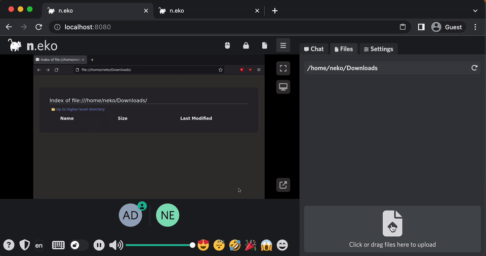

# Others

- **Want to use VPN for your n.eko browsing?** Check this out: https://github.com/m1k1o/neko-vpn
- **Want to have multiple rooms on demand?** Check this out: https://github.com/m1k1o/neko-rooms
- **Want to use different Apps than Browser?** Check this out: https://github.com/m1k1o/neko-apps

## Accounts

- There are no accounts, display name (a.k.a. username) can be freely chosen. Only password needs to match. Depending on which password matches, the visitor gets its privilege:
  - Anyone, who enters with `NEKO_PASSWORD` will be **user**.
  - Anyone, who enters with `NEKO_PASSWORD_ADMIN` will be **admin**.
- Disabling passwords is not possible. However, you can use following query parameters to create auto-join links:
  - Adding `?pwd=<password>` will prefill password.
  - Adding `?usr=<display-name>` will prefill username.
  - Adding `?cast=1` will hide all control and show only video.
  - Adding `?embed=1` will hide most additional components and show only video.
  - Adding `?volume=<0-1>` will set volume to given value.
  - Adding `?lang=<language>` will set language to given value.
  - Adding `?show_side=1` will show the sidebar on startup.
  - Adding `?mute_chat=1` will mute the chat on startup.
  - e.g. `http(s)://<URL:Port>/?pwd=neko&usr=guest&cast=1`

## Screen size

- Only admins can change screen size.
- You can set a default screen size, but this size **MUST** be one from the list, that your server supports.
- You will get this list in frontend, where you can choose from.

## Clipboard sharing

- Browsers have certain requirements to allow clipboard sharing.
  - Your instance must be HTTPS.
  - Firefox does not support clipboard sharing.
  - Use Chrome for the best experience.
- If your browser does not support clipboard sharing:
  - Clipboard icon in the bottom right corner will be displayed for host.
  - It opens text area that can share clipboard content bi-directionally.
  - Only plain-text is supported.

## File transfer

With `NEKO_FILE_TRANSFER_ENABLED=true`:

